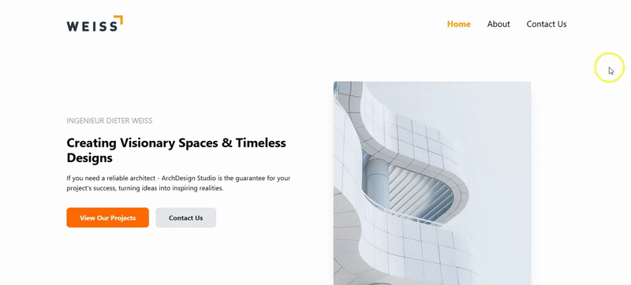

# Latihan Website Portofolio Arsitektur dengan React & Tailwind CSS

Proyek ini adalah website multi-halaman yang sepenuhnya responsif untuk sebuah firma arsitektur fiktif bernama **ArchDesign Studio**. Proyek ini dibuat sebagai latihan untuk memperdalam pemahaman tentang React, state management sederhana, dan desain responsif menggunakan Tailwind CSS.

## Halaman yang Dibuat

1.  **Home Page**: Menampilkan _hero section_ yang menarik, pengenalan singkat, dan kartu layanan yang mendetail.
2.  **About Page**: Berisi sejarah perusahaan dengan layout teks dan gambar yang kreatif dan responsif.
3.  **Contact Page**: Menyediakan formulir kontak yang fungsional di mana data yang dikirim akan disimpan di `localStorage` dan ditampilkan langsung di bawahnya.

## Fitur Utama

- **Desain Responsif**: Semua halaman dioptimalkan untuk tampilan yang baik di berbagai perangkat, mulai dari mobile, tablet, hingga desktop.
- **Struktur Berbasis Komponen**: Proyek ini dipecah menjadi komponen-komponen yang dapat digunakan kembali seperti `Navbar`, `Footer`, `Card`, dan `Input` untuk menjaga kode tetap bersih dan terorganisir.
- **Styling Modern dengan Tailwind CSS**: Seluruh styling dilakukan menggunakan utility classes dari Tailwind CSS untuk pengembangan yang cepat dan konsisten.
- **Formulir Interaktif**: Halaman kontak memiliki formulir yang menyimpan data masukan pengguna ke `localStorage` peramban.
- **State Management dengan Hooks**: Menggunakan hook `useState` untuk mengelola input formulir dan `useEffect` untuk memuat data dari `localStorage` saat komponen dimuat.

## Teknologi yang Digunakan

- **React**: Library JavaScript untuk membangun antarmuka pengguna.
- **Tailwind CSS**: Kerangka kerja CSS berbasis utility-first untuk styling.
- **Vite**: Alat pengembangan frontend modern untuk memulai proyek dengan cepat.
- **LocalStorage**: API peramban untuk menyimpan data di sisi klien.

## Preview

